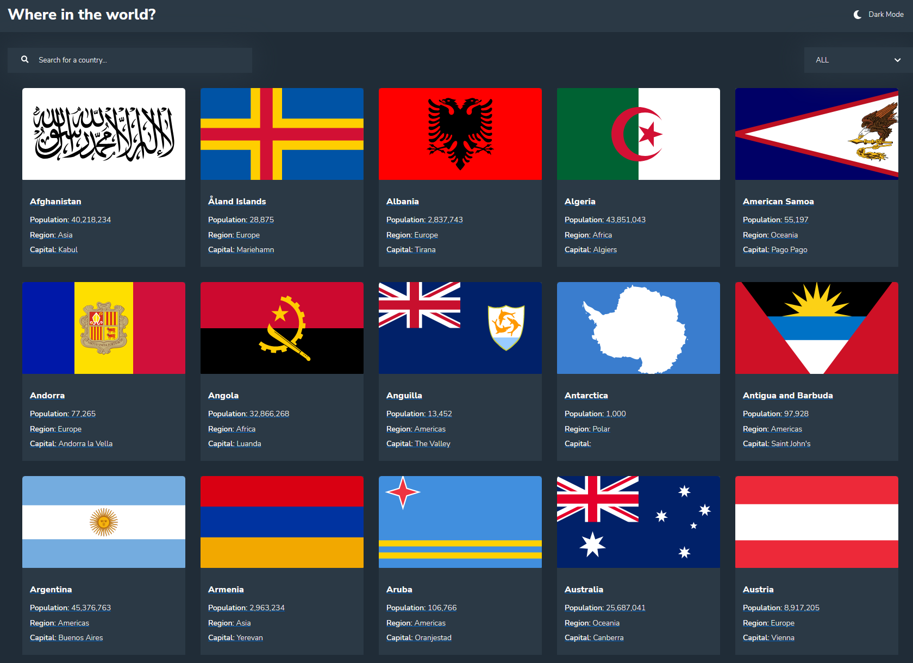

# Frontend Mentor - REST Countries API with color theme switcher solution

## Welcome! 👋

This is a solution to the [REST Countries API with color theme switcher challenge on Frontend Mentor](https://www.frontendmentor.io/challenges/rest-countries-api-with-color-theme-switcher-5cacc469fec04111f7b848ca). 
- Live Site URL: [Live Site](https://rest-contries-mt.netlify.app/)

## Table of contents

- [Frontend Mentor - REST Countries API with color theme switcher solution](#frontend-mentor---rest-countries-api-with-color-theme-switcher-solution)
  - [Welcome! 👋](#welcome-)
  - [Table of contents](#table-of-contents)
  - [Overview](#overview)
    - [Screenshot](#screenshot)
    - [Links](#links)
  - [My process](#my-process)
    - [Built with](#built-with)
    - [What I learned](#what-i-learned)
  - [Author](#author)

## Overview

The app displays country information pulled from [REST Countries V2 API](https://restcountries.com/#api-endpoints-v2).

Users should be able to:

- See all countries from the API on the homepage
- Search for a country using an `input` field
- Filter countries by region
- Click on a country to see more detailed information on a separate page
- Click through to the border countries on the detail page
- Toggle the color scheme between light and dark mode

### Screenshot

### Links

- Solution URL: [Solution URL](https://www.frontendmentor.io/solutions/rest-countries-FnS9dVJMT)
- Live Site URL: [Live Site](https://rest-contries-mt.netlify.app/)

## My process

### Built with

- HTML
- SCSS - Styles
- FETCH - API Calls
- REACT/TypeScript - JS Framework
- REACT ROUTER - Web Navigation

### What I learned
I was able to gain practical experience using SCSS, FETCh and React-Router.
I also learned how to create and implement a custom skeleton loading component, aswell as other custom components including custom search bar and menu.

## Author

- Website - [Mondara](https://mondarathotage.com/)
- Linkedin - [@Mondara](https://www.linkedin.com/in/mondara-thotage/)
- Github - [@Mondara](https://github.com/Mondara)

